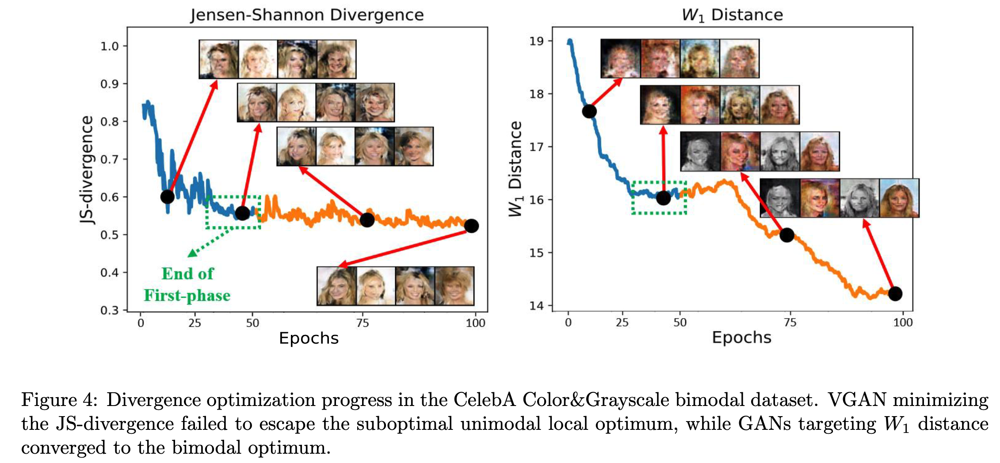

# On Convergence in Wasserstein Distance and f-divergence Minimization Problems

This is the official code repository of AISTATS'2024 paper: "On Convergence in Wasserstein Distance and f-divergence Minimization Problems".

## Brief Introduction
Generally, we found *mode-seeking* divergence (e.g. JS divergence, reverse KL divergence) may be trapped in suboptimal local optima which missing one or more modes when facing multimodal distributions, while *mode-covering* divergence (e.g. $W_1$-distance) could escape such suboptimal local optima.




## Training Mechanism

The experiment part aims at revealing the phenomenon of different behaviors between mode-seeking and mode-covering divergences.

The training paradigm is very similar to the original GAN training, except for two cases:

1. The training involves two datasets and two dataloaders, one represents the suboptimal local optima (e.g. missing flipped MNIST digits, missing grayscale real images), the other contains the full multimodal distribution (e.g. containing both original and flipped MNIST digits, both grayscale and color real images)
2. The training contains two phases, the first phase is trained with partial dataloader, and the second phase is trained with full dataloader. Then, this could examine whether a divergence method could help GANs jump out from the bad local optima (achieved at the end of first training phase).

## Code

Before running the training codes, please modify GAN.py / WGAN.py according to your desired generator and discriminator architecture, and dataset configurations. If you wish to reproduce our results, we have listed the detail configurations in the paper for your reference.

Train with JS-divergence / $W_1$ distance
``` 
    Python GAN.py / WGAN.py
```

Train with $W_1$-JS Hybrid divergence (by spectral normalization)
``` 
    Python GAN.py --sn (optional: --lip [value])
```

Train with $W_1$-JS Hybrid divergence (by weight clipping)
``` 
    Python GAN.py --clip [value]
```